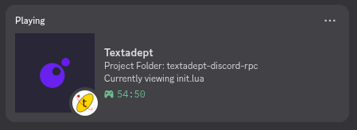

# Textadept Discord RPC

Simple Discord Rich Presence for Textadept. Requires Textadept 13+.



Install this module by copying it into your *~/.textadept/modules/* directory or Textadept's
*modules/* directory, and then putting the following in your *~/.textadept/init.lua*:

```lua
local discord_rpc = require('discord_rpc')
discord_rpc.init()
```

Discord must be running before you start Textadept. Your Discord status will show information and images for the current buffer you are working on.
You can set a privacy mode that limits the details with `discord_rpc.private_mode = true`.

This is untested on macOS and I can't offer any builds for that platform. It will very likely need some work before being functional there.

## About

RPC is achieved via @harmonytf's fork of Discord's unmaintained RPC libary.

Whilst the now recommend way to implement RPC is to use the [Discord Social SDK](https://discord.com/developers/docs/discord-social-sdk/overview), to even download it requires stating details about your "Company Name, Team Location, Role" etc. that simply don't apply for open source hobby projects.

Please petition Discord to provide [a better option](https://github.com/discord/discord-rpc/issues/382#issuecomment-3620635979) for open source applications to integrate with RPC. I am not interested in trying to make a server myself (i.e. "hard mode") the same way as other Rich Presence extensions work for VSCord, Neocord, Emacs-RPC... etc. They previously offered a pleasant, openly licensed C interfaced library for this, there's no reason they can't again. From what I can tell in Discord's RPC visualiser, the code in the Social SDK is reusing this library anyways! Luckily the fork seems to be pretty well maintained and is about as close to "official" as I can find that fits within project requirements.

## Building

The library is built with [Xmake](https://xmake.io/). Before anything, after cloning this repo ensure the DiscordRPC submodule (and it's own rapidjson submodule) are fetched:

`git submodule update --init --recursive`

You can then issue the build with `xmake`. Xmake will automatically build and use the underlying library.
Search through the `./build/platform/arch/mode` to the folder that contains the library and Lua file, which can be copied into the module folder.
There is an install rule for `xmake i` that will install into `~/.textadept/modules/discord_rpc` but only works on Linux.

Note that as Textadept 13 is using Lua 5.5.0, I have checked it into Git. Due to limitations on Windows a small Lua build must be bundled into the DLL, and must be ABI compatible with Textadept's runtime.

## Assets

Assets and their keys are tied to the Discord "app" that can be accessed/updated with a developer account. The application_id signifies to Discord which app is running and is hard-coded into shared library.
I have set the assets to have the same names as Textadept's lexers, the icons are from the VSCord project. The assets are checked into the repo for completion's sake,  you do not need a local copy.

I have made a Discord Developer Team for this (and possibly future) Discord projects. If you would like to be added for direct access to the application_id or adjusting the assets please open an issue with the required Discord details so I can add you. In the spirit of of being open when asking you to share such information, my Discord username is (unsurprisingly) m0jxd.

## Thanks

- The icons are from the VSCord project.
- Mitchell for Textadept.

## TODO

- Code cleanup, more/improved features
- Add LDoc and unit tests to align this module quality wise to Textadept's official ones
- Setup GitHub Actions build
