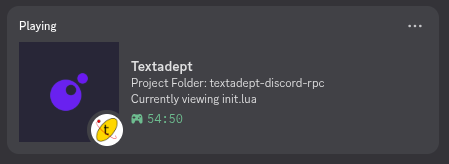

# Textadept Discord RPC

Discord Rich Presence for Textadept.



Install this module by copying it into your *~/.textadept/modules/* directory or Textadept's
*modules/* directory, and then putting the following in your *~/.textadept/init.lua*:

```lua
require('discord_rpc')()
```

There will be a "Help > Discord RPC" menu. On startup Textadept will try to connect to Discord.
Your Discord status will show information for the current buffer you are working on.
You can set how detailed this information is with [`discord_rpc.private`](#discord_rpc.private).
A buffer statusbar section will show an emoji representing connection status, but can be
disabled with [`discord_rpc.show_connected`](#discord_rpc.show_connected).
If you don't want to connect automatically at startup, require the module without calling it,
and connect using the menu option.

#### Notes

- Your Discord client needs to be running before Textadept is started.
- Resetting Textadept frequently and rapidly can cause connection failures.

## About

RPC is achieved via @harmonytf's fork of Discord's unmaintained RPC libary.

Whilst the now recommend way to implement RPC is to use the
[Discord Social SDK](https://discord.com/developers/docs/discord-social-sdk/overview),
to even download it requires stating details about your
"Company Name, Team Location, Role" etc. that simply don't apply for open source hobby projects.
Please petition Discord to provide
[a better solution](https://github.com/discord/discord-rpc/issues/382#issuecomment-3620635979)
for open source applications to integrate with RPC.

## Building

The library is built with [Xmake](https://xmake.io/).
Before anything, after cloning this repo ensure the submodules are fetched:

`git submodule update --init --recursive`

You can then issue the build with `xmake`.
Xmake will ask you about building the DiscordRPC library first, which you will need to confirm.
`xmake i` will install the module you built into *~/.textadept/modules/discord_rpc*.

## Assets

Assets and their keys are tied to the Discord "app" that can be updated with a developer account.
On the app page, assets are set to the same name as Textadept's lexers. Icons are from the
VSCord project, and checked into the repo for completion's sake. A local copy is not required.

I have made a Discord Developer Team for this project. If you would like to be added please open
an issue or contact me (m0jxd) via Discord with the required details.

## Thanks

- The icons are from the VSCord project.
- @orbitalquark for Textadept.
- @harmonytf for the Discord RPC library fork.


<a id="discord_rpc.attempts"></a>
## `discord_rpc.attempts`

Maximum allowed attempts to connect to Discord.

The default value is `20`.

<a id="discord_rpc.close"></a>
## `discord_rpc.close`()

Closes down RPC connection and removes handlers.

<a id="discord_rpc.connect"></a>
## `discord_rpc.connect`()

Connects to RPC and attaches handlers.

Do not call from init.lua. Call the module instead to connect automatically at startup.

<a id="discord_rpc.edge_names"></a>
## `discord_rpc.edge_names`

Edge case lists for lexer names that can't be capitalised or should be described with 'an'.

Fields:
- `names`:  Array of lexer names that are not suitable for first letter capitalisation.
- `an`:  Array of lexers that should use 'an' instead of 'a' to refer to the file.

<a id="discord_rpc.presence"></a>
## `discord_rpc.presence`

Status fields sent to RPC.

Fields:
- `send_presence`: Whether to send presence to Discord.
- `state`: Phrase for current user action.
- `details`: Further details on current user action.
- `startTimestamp`: Start time for this activity.
- `endTimestamp`: End time for this activity.
- `smallImageKey`: Key name for the small image.
- `smallImageText`: Hover text for the small image.
- `largeImageKey`: Key name for the large image.
- `largeImageText`: Hover text for the large image.

<a id="discord_rpc.private"></a>
## `discord_rpc.private`

Whether to use a privacy mode that only states file types instead of their actual names.

The default value is `true`.

<a id="discord_rpc.show_connected"></a>
## `discord_rpc.show_connected`

Display 'DRPC' status in buffer_statusbar.

The default value is `true`.

<a id="discord_rpc.stats"></a>
## `discord_rpc.stats`

Status fields received from RPC.

Fields:
- `username`: Username of connected RPC user.
- `globalName`: Global Name of connected RPC user.
- `userId`: ID of connected RPC user.
- `discriminator`: Discord's discriminator for the RPC connection.
- `lastCallback`: Last callback called by underlying library.
- `errcode`: Last error code that occured.
- `errorDetails`: Details for last error code.

<a id="discord_rpc.update"></a>
## `discord_rpc.update`()

Updates presence details, sends them over RPC, receives RPC status and updates UI accordingly.
